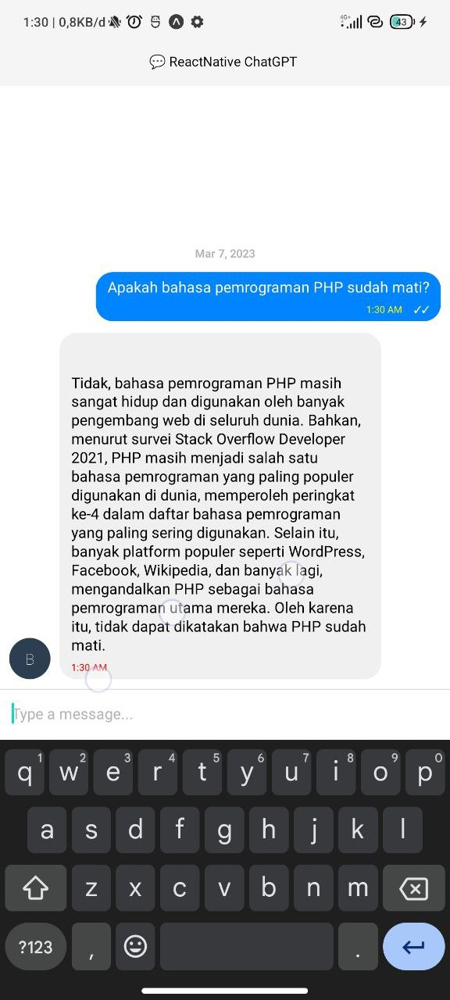

<h1>AN EXAMPLE CHAT GPT BOT</h1>

# INSTALLATION

- Copy `.env.example` to `.env`
- Register to <a href="https://platform.openai.com/">ChatGPT</a>
- Put your `API_KEY` to `CHAT_GPT_KEY`

# SCREENSHOT

